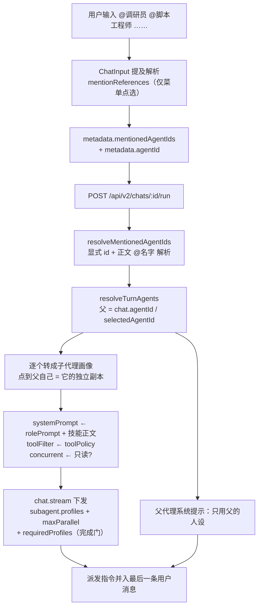
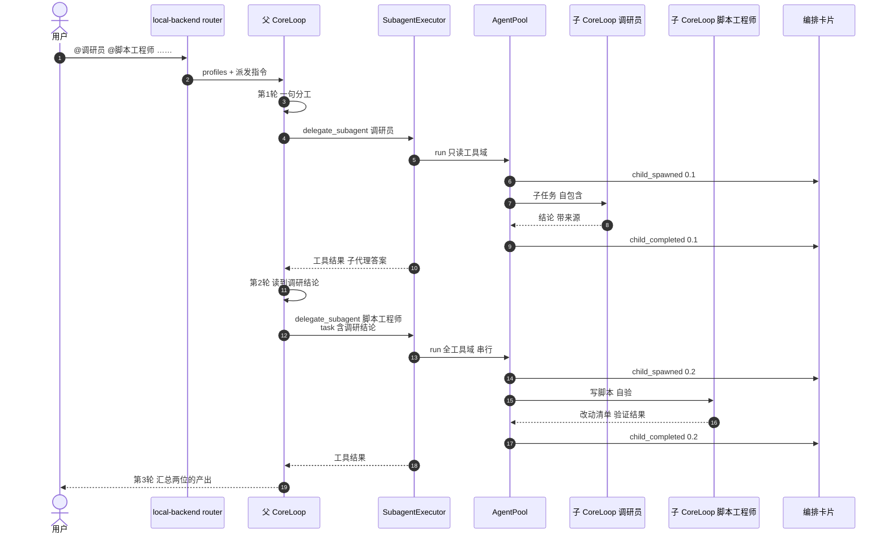

# `@` 提及 → 子代理委派

> 状态：**W1 已落地**（2026-09-20）。W2（子代理独立工具身份）尚未开始。
>
> 目标：把输入框里的 `@某个智能体` 从「本轮换人设回答」改成「把活交给子代理」，
> 并支持一次交给多个智能体。

---

## 1. 现状（改前）：`@` 是人设覆盖，不是委派

下面记录的是 W1 之前的行为，用来对照目标。现已改为 §2。

被 `@` 的智能体会**顶替**本轮的角色，自己并不作为独立代理运行：

- 前端把提及收进 `metadata.mentionedAgentIds`
  （`packages/agent-shell/web/src/components/chat/LocalChatPanel.tsx:247`、
  `packages/agent-shell/web/src/pages/AgentPage.tsx:1278`）。
- `resolveTurnAgents` 把提及排在 `payload.agentId` / `chat.agentId` **之前**，
  有提及时绑定智能体整个退出本轮
  （`packages/agent-shell/ts/src/local-backend/router.ts:2382`）。
- 多个提及被合成一段「你同时具备以下 N 个角色」的人设前言，能力面取最宽松
  （同文件 `:2486`、`mergeAgentCapabilities`）。

实测（2026-09-20，会话 `a2bcb30c`）：会话绑「电脑操作员」，发 `@智能助手 你好`，
回复变成「我是智能助手」，模型的思考里明确在纠正自己的身份。链路通，但语义是换人设。

一个副作用：助手消息没有落 `agentId`，历史里看不出这轮是谁答的。

## 2. 目标行为（已确认的四个决定）

| 决定 | 结论 |
| --- | --- |
| `@` 的语义 | **只做委派**。换主答者用输入框已有的专家下拉（`AgentSelect` → `selectedAgentId`），两条路径不再重叠 |
| 是否强制派发 | **强制**：每个被 `@` 的智能体本轮都必须收到一份子任务（`requiredProfiles` 完成门兜底，见 §5），与「`/` 点名工具即强制调用」的既有立场一致 |
| 点名父代理自己 | **也起子代理**：`@` 只表示「起一个子代理」，点自己就是起一个自己的独立副本；父代理的拆分/汇总身份不变 |
| 多个提及怎么跑 | **按权限定并发**：只读工具域的可并行，带写/执行权限的串行，避免两个代理同时改同一批文件 |
| 子代理的技能 | **一期就带**：把该智能体的技能正文渲进子代理的系统提示，否则 `@智能助手`（无条件加载全部技能）名不副实 |
| 依赖关系谁判定 | **交给模型**：只有读懂任务才知道子任务之间有没有依赖，指令里把两种形状说清（见 §5） |
| 子代理权限 | **各自的策略说话**，父的收窄不传染。当前代码做不到，需要 W2 的框架改造（见 §9）；W2 之前实际行为必然是 `子 ⊆ 父` |

会话绑定的智能体保持为**父代理**：它负责拆分、派发、汇总，不再被提及顶掉。

## 3. 现成接缝（不用改循环）

框架侧三件套都已就位，这次基本是**把桌面的智能体翻译成画像**：

- `chat.stream` 支持按回合下发 `subagent.profiles`，每个画像带
  `systemPrompt` / `toolFilter` / `maxRounds` / `concurrent` / `description`
  （`packages/agent-shell/ts/src/sidecar/types.ts:358`，
  sidecar 侧注册见 `packages/sidecar/py/src/steerable_sidecar/sidecar.py:1903`）。
- 桌面当前只传内置三画像 `explore` / `research` / `coder`
  （`packages/agent-shell/ts/src/local-backend/subagent-profiles.ts:85`，
  接线点 `router.ts:3294`）。
- 子代理生命周期已经经 `agent.child` → `orchestration_child` SSE → `OrchestrationChildrenCard`
  （`router.ts:3378`）。

所以改动集中在：画像怎么生成、派发指令怎么写、卡片怎么显示名字。

## 4. 映射规则：ChatAgent → 子代理画像

| 画像字段 | 取值 | 说明 |
| --- | --- | --- |
| 画像名（`subagent_type`） | `agent.slug` | 稳定 ASCII，进工具 schema 的 enum；显示名另行映射 |
| `description` | `agent.name` + `rolePrompt` 摘要 | 模型按用途选委派对象，schema 会把它列进 roster |
| `systemPrompt` | `buildSystemPrompt({ personaPreamble: rolePrompt, pinnedSkillNames: skillIds, ignoreConditions: loadAllSkills, identityName: agent.name })` | 复用现有拼装器；子代理看不到主对话的系统提示，这就是它的全部角色设定 |
| `toolFilter` | 由 `agent.toolPolicy` 解析：`allowlist` → 该清单；`denylist` → 全集减去；`all` → 不设。**W2 之前再与父的工具面取交集**（§9.3） | 收窄即权限边界，被过滤的调用 fail closed 报 `tool_not_delegated` |
| `concurrent` | 工具域只读 → `true`；含写/执行 → `false` | 与内置 `coder` 画像的立场一致 |
| `maxRounds` | **不下发** | 子代理跟父循环同一套 `default.harness.yaml` 轮次/连续工具失败上限（80 / 16）。父对话打满会自动续跑；再给子代理单独钉 12/16 轮会让侦察在父还远没停时就以 `budget_exhausted` 结束 |

两个必须处理的边界：

- **自提及也起子代理**：`@` 到会话绑定的智能体本身时，同样为它转出画像并要求派发——
  `@` 的语义是「起一个子代理」，点自己就是起一个自己的独立副本（看不到本对话、
  自带一份自包含任务书）。父代理的身份不变，仍由它拆分与汇总。派发指令会给这一行
  加一句「就是你自己的画像，起一个独立副本去跑」，否则模型会顺手自己做，而
  `requiredProfiles` 完成门会一直把回合退回来。
- **并行预算**：池的并行上限默认 4，第 5 个子代理直接 fail closed 报
  `orchestration_budget_exceeded`（`packages/agent-runtime/py/src/steerable_agent_runtime/pool.py:182`）。
  被 `@` 超过 4 个时要把 `subagent.maxParallel` 按实际人数下发
  （顶层参数才生效，见 `sidecar.py:1948`）。

## 5. 拆分与派发：两种形状

这是设计里最容易做错的一处。关键约束有两条：

1. **`task` 必须自包含**——子代理看不到主对话
   （`packages/agent-runtime/py/src/steerable_agent_runtime/subagent.py:146`）。
   所以「拆分」不是可选步骤，主代理必须为每个子代理写一份完整任务书。
2. **并行只在同一轮之内**——合批只扫单次助手响应的 `tool_calls`，
   且只有**连续**的可并行调用才合批
   （`packages/agent-runtime/py/src/steerable_agent_runtime/loop.py:1725`）。

由此推出两种形状，取决于子任务之间有没有依赖：

**形状 A · 独立子任务 → 同轮并行。** 一句分工说明 + N 个 `delegate_subagent`
一次性发出，只读画像连续排列即并行执行。

**形状 B · 有依赖 → 跨轮串联。** 同一轮发出的调用里，后面那份 `task` 在
前一个子代理返回**之前**就定稿了，拿不到它的结论。所以有依赖时必须按依赖链
跨轮派发，并在后一轮把前一轮的结论写进 `task`。

因此强制的是「每个被 `@` 的智能体最终都要收到任务」，**不是**「都在第一轮派」。

**不做独立的「只出计划」轮次。** 先输出一段分工然后停手，正是
`skills/81-anti-deferred/SKILL.md` 零容忍的失败用例（「接下来我会调用 X」本轮无
tool_call 判违规），`antiHallucination` 的 deferred-retry 钩子会强制重试。
同一份技能的通过用例恰好就是形状 A：「好的，我先……」+ 同轮立刻发调用。
另外「先出计划不执行」的语义已被 Plan 模式（`70-plan-mode`，只读工具面）占用，
不在 agent 模式里再造一个。

### 派发指令（注入本轮最后一条用户消息）

> 用户点名了 **调研员**、**脚本工程师**。本轮你必须把活交给它们，用
> `delegate_subagent`（`subagent_type` 填画像名），每人至少一份子任务。
>
> - 子任务**彼此独立**时：一句话说明分工，紧接着在**同一轮**把全部调用发出，
>   并把可并行的排在一起。
> - 子任务**有依赖**时：按依赖顺序分轮派发，并把前一轮的结论写进后一轮的 `task`。
> - 每份 `task` 必须自包含（目标、输入、交付形式、验收标准）——子代理看不到本对话。
> - 禁止只写分工然后停手；也禁止漏掉任何一位被点名的代理。

### 提及来源：显式 id 与正文解析

渲染层只在从 `@` 菜单**点选**时才生成 `metadata.mentionedAgentIds`；手打的
`@名字` 不带 id。后端只认 id 的话，手打提及在后端等于没提及——不下发画像、
不注入派发指令——而 Web 顶栏按正文扫 `@词` 画徽章，于是界面显示点了三个人、
实际一个都没派活（2026-09-20 实测会话 `d7d027a2`，落库 user 消息 metadata 为空）。
`mention-targets.ts` 把正文解析补在后端：显式 id 优先，正文按「最长画像名/slug
前缀」补齐（中文没有词边界，`@日程规划，…` 的标点不会被吃进名字）。

### 强制派发的兜底：`requiredProfiles`

派发指令是提示词，模型可以绕过：跑一串别的工具、然后写「三位智能体已启动」，
`antiHallucination` 的伪完成检查也不会响——它只在**整轮零 tool_call** 时才判违规。
所以提及画像名同时作为 `subagent.requiredProfiles` 下发，sidecar 据此挂
`RequiredDelegationGate`（`before_completion`）：`completed` 且仍有画像没收到
`delegate_subagent` 就退回重试并点名缺的那几个。

- 只拦 `completed`；`budget_exhausted` / 失败各有自己的续跑路径。
- 委派**发起过**就算满足，不看子代理成败——子代理失败是父代理要汇报的事，
  重派只会打转。
- 自带重试上限（默认 2），外层还有循环自己的 completion-redo 预算兜底。

## 6. 流程图

### 6.1 解析阶段：提及 → 画像



### 6.2 调用时序：一次带依赖的双代理委派



父子的审批与工具执行都走既有通路：`ApprovalExecutor` 包在最内层，子代理的工具
调用同样弹审批；工具本体经反向通道回宿主执行。子代理**不能再派子代理**
（depth-1，构造性保证，`subagent.py:10`）。

### 子代理的执行过程怎么看

子代理的思考与工具调用**不进**父回合的事件流（`pool.py` 的 `_run_child` 只把
`content_delta` 累成最终答案，对外仅发 spawned / completed / failed）。要在界面上
回看，走的是它自己的 durable record：`SubagentExecutor` 拿到 `history_store` +
`record_id_prefix` 后，每个子回合以 `<父 record>:child:<lineage id>` 落库，record id
随 `child_spawned` 上报。

- 宿主 `GET /api/v2/child-process?recordId=…` 用 `readSidecarHistoryEntries` +
  `timelineFromHistoryEntries` 重建时间线——与后台任务过程面板同一套函数。
- `委派 · X` 工具行按「画像名 + 任务正文」对上子代理（`task` 就是这次调用的
  `task` 参数，精确相等；同画像多份活按出现顺序消费），点一下在右侧开
  「子代理推理」。运行中每 1.5s 轮询它的 record（子代理不是任务，没有
  `task-process` 广播通道）。
- 没给 store / prefix 时子代理仍然 storage-free，行也就不可点。

## 7. 模拟场景（请按这个确认）

**前置**：会话绑定「电脑操作员」（父）。用户另建两个专家：

| 智能体 | rolePrompt 摘要 | toolPolicy | 推导出的画像 |
| --- | --- | --- | --- |
| 调研员 | 多轮联网调研，结论必须带来源 URL | allowlist：`web_fetch` `web_search` `local_read_file` | 只读 → `concurrent: true`，轮次跟父循环 |
| 脚本工程师 | 写脚本解题，完成后必须自验 | all | 含写 → `concurrent: false`，轮次跟父循环 |

**用户输入**

```
@调研员 @脚本工程师 我下载目录里有一堆发票 PDF。先搞清楚现在有哪些开源工具
能批量提取 PDF 里的金额，然后写个脚本把金额汇总成 CSV。
```

**下发给 sidecar 的画像（节选）**

```jsonc
{
  "subagent": {
    "maxParallel": 4,
    "profiles": {
      "researcher": {
        "description": "调研员 — 多轮联网调研，结论带来源 URL",
        "toolFilter": ["web_fetch", "web_search", "local_read_file"],
        "concurrent": true,
        "maxRounds": 12,
        "systemPrompt": "你是 调研员。……（rolePrompt + 勾选技能正文）"
      },
      "script-engineer": {
        "description": "脚本工程师 — 写脚本解题并自验",
        "concurrent": false,
        "maxRounds": 16,
        "systemPrompt": "你是 脚本工程师。……"
      }
    }
  }
}
```

**第 1 轮**——父代理判定「写脚本依赖调研结论」，走形状 B，先派调研员：

> 分两步：先让调研员摸清可选工具，再让脚本工程师按结论落地。先起调研。

```
delegate_subagent(subagent_type="researcher", task=
  "调研 2026 年可用的开源 PDF 金额提取方案，至少覆盖 pdfplumber / PyMuPDF /
   tesseract+OCR 三类路线。每条给出：适用场景、是否需要 OCR、Python 可用性、
   来源 URL。结论按推荐度排序，交付一段 200 字以内的选型建议。")
```

子代理 `0.1` 在卡片上出现一行「调研员 · 运行中」，只读工具域——它够不到写文件。

**第 2 轮**——调研结论回到父代理，派脚本工程师，**把结论写进 task**：

```
delegate_subagent(subagent_type="script-engineer", task=
  "在 ~/Downloads 下批量提取发票 PDF 金额并汇总成 CSV。
   选型已定：优先 pdfplumber（纯文本层，无需 OCR），扫描件回退 PyMuPDF+tesseract。
   要求：1) 脚本落在 ~/Downloads/invoice_sum.py；2) 输出 invoices.csv，
   列为 文件名/发票号/金额/币种；3) 完成后真实运行一次，把前 5 行输出贴回；
   4) 无法解析的文件单独列出，不要跳过不报。")
```

子代理 `0.2` 起一行「脚本工程师 · 运行中」。它有写权限，`concurrent: false`，
不与其他写代理并发。脚本里若触发 `local_exec_shell`，审批弹窗照常弹给用户。

**第 3 轮**——父代理汇总两位产出：选型依据（带来源）+ 脚本路径 + 真实运行结果 +
未解析清单。卡片上两行都是绿色终态。

**对照：纯并行的样子。** 如果输入是
`@调研员 @法务顾问 分别查一下这两个方向`（两个都只读、彼此独立），
父代理第 1 轮就把两个调用连续发出，`0.1`/`0.2` 同时运行，卡片两行一起转。

## 8. W1 · 桌面接线（已落地）

| 位置 | 改动 | 状态 |
| --- | --- | --- |
| `router.ts` `resolveTurnAgents` | 提及不再进人设链；返回 `{ parent, delegates }` | 已做 |
| `router.ts` `buildConversationMessages` | 有 delegates 时注入派发指令 | 已做 |
| `subagent-profiles.ts` | ChatAgent → 画像映射（`buildSystemPrompt`、`toolPolicy` → `toolFilter`、只读判定、W1 夹紧 `子 ⊆ 父`） | 已做 |
| `router.ts` `subagent` 参数 | 内置画像 + 本轮提及画像，`maxParallel` 按人数 | 已做 |
| `orchestration-children-model.ts` | `child_spawned` 捕 `profile`；`extractPersistedOrchestrationChildren` 水合 | 已做 |
| `router.ts` 助手 metadata | 落 `agentId`（父）与 `orchestrationChildEvents`（刷新后卡片仍在） | 已做 |
| `OrchestrationChildrenCard.tsx` | `renderTaskRow`：显示名 + 智能体颜色点 | 已做 |
| 用户消息 metadata | 落 `mentionedAgentIds`；chip 从正文 `@Name` 还原 | 已做 |

测试：

- `router-mention-delegate.test.ts` / `router-stream.test.ts`：单个提及 → 画像下发且人设仍是父；多个提及 → 多画像；手打 `@名字` 无 id 也派发；自提及起自己的副本；提及 5 个 → `maxParallel` 跟着抬；子代理事件写入 `orchestrationChildEvents`。
- 画像映射单测：`allowlist` / `denylist` / `all` 三种 `toolPolicy` 的 `toolFilter` 与 `concurrent` 推导；`loadAllSkills` 的智能体技能正文确实进了 `systemPrompt`。
- `orchestration-children-model.test.ts`：`profile` 经 fold 存活；落库事件水合出卡片。
- `OrchestrationChildrenCard.test.tsx` / `AgentPage.test.tsx`：两行显示智能体名字而非 slug，刷新后卡片仍在。
- desktop-canary（真实 Electron + CDP）未加：需要跑着的桌面应用；卡片断言由上面的组件/页面测试覆盖。

派发指令措辞已按 §5 落地。

## 9. W2 · 子代理身份与独立工具面（框架改造，独立一期）

目标：让子代理按**自己的**工具策略执行，父的收窄不传染。

### 9.1 为什么现在做不到

两道独立机制同时把子代理夹在父的工具面之内：

**广告层。** 子代理的候选工具是父已广告工具的子集，`toolFilter` 只能收窄：

```python
# packages/agent-runtime/py/src/steerable_agent_runtime/subagent.py:366
schemas = [
    schema
    for schema in self._parent_tools
    if _schema_name(schema) != self._config.tool_name
    and (tool_filter is None or _schema_name(schema) in tool_filter)
] or None
```

`_parent_tools` 即 sidecar 收到的父工具列表（`sidecar.py:1956`），它来自
`listModelSchemas(turnAgents.capability.toolPolicy)`（`router.ts:2185`）。
父只读时，子代理的候选池里根本没有写工具。

**分发层复检。** 工具策略每条流下发一次（`router.ts:3282`），反向通道对每个调用
复检（`tool-router.ts:755`），而 `tool.invoke` 的 context 只有
`{mode, chatId, workspaceRoot, toolPolicy}`（`reverse-tools.ts:51`）——不带子代理
身份，宿主分不清调用来自父还是哪个子代理。

**排除掉的走法：把下发的 `toolPolicy` 改成父子并集。** 那样父代理自己也能直调子代理
的写工具。这道复检存在的理由恰恰是「模型可能从历史或幻觉里捞出名字直调」
（`tool-router.ts:753`），并集会把父的限制降级成摆设，双层执行的保证就没了。

### 9.2 要改什么

| 层 | 改动 |
| --- | --- |
| protocol | `tool.invoke` 的 `context` 增 `childId`（lineage id，如 `0.1`）与 `profile`（画像名）；父代理自己的调用不带，保持旧字节 |
| runtime | `AgentPool` 把 child 身份透到子 loop 的 `ToolExecutor` 调用链（`LoopContext` 已按 run 隔离，需要一条 per-run 的 tool-context 通道） |
| sidecar | `HostToolExecutor` 的 `tool_context` 现在是构造时固定的，改为按调用来源补 `childId` / `profile`；`subagent` 参数新增子代理工具快照（一份可比父更宽的 tools 列表） |
| host | `reverse-tools.ts` 按 `childId` / `profile` 找对应画像的策略复检，而不是一律用父的；router 需要把本轮「画像名 → 工具策略」映射留给反向通道 |
| 一致性 | 线格式改动要过 conformance 套件；`tool.invoke` 是公开 RPC，属破坏性变更面，按 spec 走 |

W2 落地后 W1 的画像映射改一处：`toolFilter` 不再与父取交集，直接用该智能体自己的
策略。

### 9.3 过渡期的事实

W2 之前 W1 的实际行为必然是 `子 ⊆ 父`——这是代码构造，不是配置。因此过渡期要：

- 画像映射显式取交集（而不是假装用子自己的策略，否则 UI 承诺与执行不一致）；
- 父代理工具面比子窄时，在派发指令里如实说明该子代理本轮只有哪些工具，
  避免子代理反复撞 `tool_not_delegated`。

## 10. 顺序

**W1 先上**（2026-09-20 确认）：带 §9.3 的过渡期夹紧，`@` 委派尽快可用；
W2 独立推进，落地后回改 W1 一处（`toolFilter` 不再与父取交集）。

理由：W2 动 `tool.invoke` 线格式并要过 conformance，体量与评审面都大于 W1，
压在一起会让 `@` 委派迟迟看不到。

```text
W1 桌面接线 ──→ 可用的 @ 委派（子 ⊆ 父）   ← 已落地
                      │
W2 子代理身份 ────────┴─→ 各自权限（回改 W1 一处）
```
